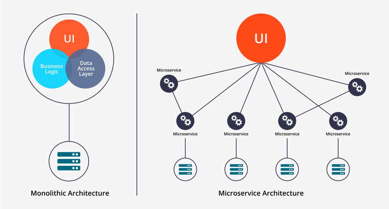
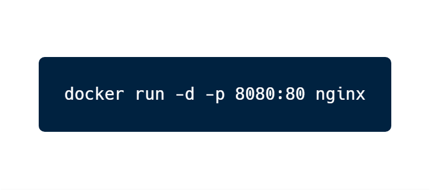
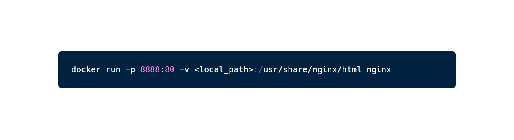
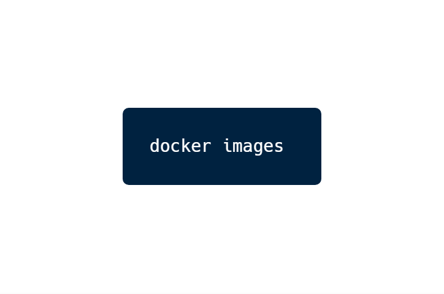
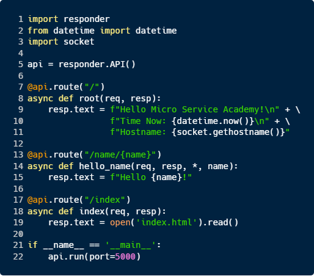
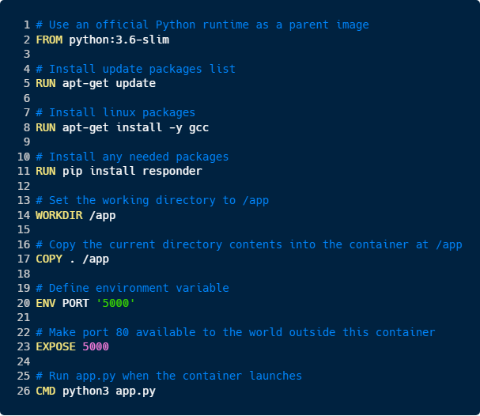

## Introduction to Docker Containers

#### Micro-Services Academy, November 2018

###### [Yonatan Bitton](mailto:yobitton@microsoft.com)/[@bityob](http://www.twitter.com/bityob)

---

### Agenda

- Micro Services
- Containers
- Docker

Notes: 

---

### What is a Monolitic Service

> In software engineering, a monolithic application describes a <strong>single-tiered software</strong> application... code are combined into a single program from a single platform.


---

### What is a Monolitic Service


###### Source: https://bits.citrusbyte.com/microservices/

Notes: 

Source: https://bits.citrusbyte.com/microservices/

---

### Strengths of the Monolithic Architecture

- Less cross-cutting concerns
- Easier debugging and testing
- Simple to deploy

Notes: 

https://www.n-ix.com/microservices-vs-monolith-which-architecture-best-choice-your-business/

- Cross-cutting concerns are the concerns that affect the whole application such as logging, handling, caching, and performance monitoring. Only one application so it is easier to handle it.
- Since a monolithic app is a single indivisible unit, you can run end-to-end testing much faster.
- Easier deployment. When it comes to monolithic applications, you do not have to handle many deployments - just one file or directory.

---

### Weaknesses of the Monolithic Architecture


- Understanding
- Making changes
- Scalability
- New technology barriers

Notes: 

https://www.n-ix.com/microservices-vs-monolith-which-architecture-best-choice-your-business/

- When a monolithic application scales up, it becomes too complicated to understand
- It is harder to implement changes in such a large and complex application with highly tight coupling. Any code change affects the whole system so it has to be thoroughly coordinated. This makes the overall development process much longer.
- Scalability. You cannot scale components independently, only the whole application.
- New technology barriers. It is extremely problematic to apply a new technology in a monolithic application because then the entire application has to be rewritten.

---

### What is a Micro Service



##### Source: [Medium/startlovingyourself](https://medium.com/startlovingyourself/microservices-vs-monolithic-architecture-c8df91f16bb4)

Note: 

- Describe what is a micro service 
- After we explained what is a monolithic service, we can see how differ are micro services
- No only one service which does everything, but multiple service, each with it's own responsibility
- Easy to scale, easy to develop each part

---

### Why Micro-services?

- Single Responsibility Principle
- Application is easier to understand, develop and test
- Allows high scalability and reusability
- Parallelizes development
- Enable continuous delivery and deployment
- Better fault isolation
- Code can be written in different languages


Note: 

Source: 

Idan's vNext Architecture presentation - 
https://microsoft.sharepoint.com/teams/osg_core_ens/wcd/Shared%20Documents/Architecture/WD%20ATP%20vNext%20Architecture.pptx

---

### Micro Services using Containers


##### Source: [RedbadgerTeam](https://blog.red-badger.com/blog/deploy-a-microservices-application-as-though-it-was-a-monolith)

Notes: 

- Containers are a technology which best fit to this need of micro services
- What are containers? 

Links - 

https://blog.red-badger.com/blog/deploy-a-microservices-application-as-though-it-was-a-monolith
http://blog.enabled.com.au/microservices-innovation/

---

### World before Containers


Notes: 

- Different size, weights etc.
- Need addoption in all roads

---

### What are Containers


Notes: 

- Container with same size
- All cargo inside, all fits
- Osim Historia - https://www.ranlevi.com/2017/03/09/osim_historia_ep212_containers_part1/

---


### Container Adoption 

>  By 2020, more than 50% of global organizations will be running containerized applications in production

##### Source: [Gartner](https://www.gartner.com/smarterwithgartner/6-best-practices-for-creating-a-container-platform-strategy/)
---

### What is Docker

> Docker is an open platform for developing, shipping, and running applications.

> Docker allows you to package an application with all of its dependencies into a standardized unit for software development.

Notes:

- Docker is a container implementaion

---

### Docker vs VMs


Notes:

- Same kerenl for all apps

---

### Docker Benefits

 - Fast (deployment, migration, restarts)
 - Secure
 - Lightweight (save disk & CPU)
 - Open Source
 - Portable software 
 - Microservices and integrations (APIs)
 - Simplify DevOps
 - Version control capabilities
 - Easy configuration (Dockerfile)

Notes: 

- Avoid "Works on my machine."
- Ship container images with all their dependencies
- Break image into layers
- Only ship layers that have changed
- Save disk, network, memory usage

---

### Common Docker usages

 - Sandbox environment (develop, test, debug, educate)
 - Continuous Integration & Deployment
 - Scaling apps
 - Development collaboration
 - Local development

---

### Technology behind Docker

 - Linux [x86-64](https://www.wikiwand.com/en/X86-64)
 - [Go](https://golang.org/) language
 - [Namespaces](https://en.wikipedia.org/wiki/Cgroups#NAMESPACE-ISOLATION) (pid, net, ipc, mnt, uts)
 - Control Groups ([cgroups](https://www.wikiwand.com/en/Cgroups))
 - Union file systems ([UnionFS](https://www.wikiwand.com/en/UnionFS))
 - [Client - Server](https://www.wikiwand.com/en/Client%E2%80%93server_model) (deamon) architecture
 - Container format ([libcontainer](https://github.com/opencontainers/runc/tree/master/libcontainer))


 Notes: 

Namespaces - provide a layer of isolation
Control Groups -  limits an application to a specific set of resources. 
UnionFS -  It allows files and directories of separate file systems, known as branches, to be transparently overlaid, forming a single coherent file system
Continer Format - All together


###### See more at [Docker overview](https://docs.docker.com/engine/docker-overview/)

---

### The Docker architecture


###### See more at [Understanding docker](https://docs.docker.com/engine/understanding-docker/)

Notes:

- images
- container

---

### Docker components/objects

 - (Docker) client
 - daemon/engine
 - registry
 - image
 - container
 - Dockerfile

---

### Docker client

It is the primary user interface to Docker. It accepts commands from the user
and communicates back and forth with a Docker daemon.

---

### Docker daemon/engine

It runs on a host machine. The user does not directly interact with the daemon,
but instead through the Docker client with the RESTful api or sockets.

---

### Docker distribution/registry


A (hosted) service containing repositories of images which responds to the Registry API.

---


### The docker image


---

### The docker container

.")

Notes: 

- Docker push/pull only new layers

---


### The Dockerfile

> A Dockerfile is a text document that contains all the commands a user could call on the command line to create an image.

Notes:

- Later we will dive in, after demo of running docker

---


### Docker Run With Port Mapping



Notes: 

- Demo

docker run -p -d 8080:80 nginx

http://localhost:8080

---

### Docker Run With File System Mount




Notes: 

- Demo
docker run -p 8888:80 -v c:/Users/yobitton/Documents/Code/presentations/intro-docker/examples/nginx:/usr/share/nginx/html nginx

Change file, see changes...

Browser - http://localhost:8888/
---

### Docker Images




Notes:

- Demo

---

### Convert An App into Docker Image



Notes:

- Demo (from wsl) 

bit@YOBITTON-surface:/mnt/c/Users/yobitton/Documents/Code/presentations/intro-docker/examples/webapp$ python3 app.py
INFO: Started server process [1018]
INFO: Waiting for application startup.
INFO: Uvicorn running on http://127.0.0.1:5000 (Press CTRL+C to quit)

http://localhost:5000/ -> Hello Micro Services...
http://localhost:5000/name/yonatan -> Hello Yonatan
http://localhost:5000/index -> read index file

---

### Overview of Dockerfile for our App



Notes:

- Explain each line

---

### Build the image


Notes: 

docker build . -t docker.io/bityob/docker-python-app

---


### Run the application using Docker


Notes:

Demo (from windows) - 

docker run -p 5555:5000 docker.io/bityob/docker-python-app

C:\WINDOWS\system32>docker run -p 5555:5000 docker.io/bityob/docker-python-app
INFO: Started server process [6]
INFO: Waiting for application startup.
INFO: Uvicorn running on http://0.0.0.0:5000 (Press CTRL+C to quit)
INFO: ('172.17.0.1', 48992) - "GET / HTTP/1.1" 200
INFO: ('172.17.0.1', 48992) - "GET /favicon.ico HTTP/1.1" 404

---

### SSH into the container

```
docker run -it docker.io/bityob/docker-python-app /bin/bash
```

---


### Common Docker Commands

```
// Images
docker images
docker pull [IMAGE] 
docker push [IMAGE]

// Containers
docker run
docker ps // docker ps -a, docker ps -l
docker stop/start/restart [CONTAINER]
docker rm [CONTAINER]
```

---

### Instead of Resources

 - [Awesome Docker](https://github.com/veggiemonk/awesome-docker) (list of Docker resources & projects)
 - [Docker cheat sheet](https://github.com/wsargent/docker-cheat-sheet)
 - [Docker in Practice](https://www.manning.com/books/docker-in-practice), [The Docker Book](http://www.dockerbook.com/) (books)
 - [Docker aliases/shortcuts](https://github.com/theodorosploumis/docker-presentation/tree/gh-pages/examples/shortcuts/docker-aliases.sh)
 - Docker [case studies](https://www.docker.com/customers)
 - [examples/tips](https://github.com/theodorosploumis/docker-presentation/tree/gh-pages/examples/tips)

---

### Questions?


###### In this presentation I used [Reveal.js](https://revealjs.com/#/) and slides/ideas from [theodorosploumis](https://github.com/theodorosploumis/docker-presentation).
