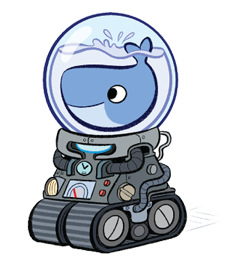
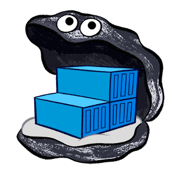

## Introduction to Docker Containers

#### Micro-Services Academy, November 2018

###### [Yonatan Bitton](mailto:yobitton@microsoft.com)

---

### Let me ask you

- Who heard about Micro Services?
- Who knows about [Docker](http://docker.com)?
- Who uses Docker for development?
- Who uses Docker in production?
- Who tried but could not do it?

Notes: 

- Need to think what questions are relvant 


---

### What is a Monolitic Service

> In software engineering, a monolithic application describes a <strong>single-tiered software</strong> application in which the... code are combined into a single program from a single platform.


---

### What is a Micro Service

- TBD

Note: 

Describe what is a micro service 

---

### What to use conatiners

- TBD


---

### What is Docker

> Docker is an open platform for developing, shipping, and running applications.

> Docker allows you to package an application with all of its dependencies into a standardized unit for software development.

---

### Docker vs VMs

<!-- .slide: data-background="#dddddd" -->


---

### Docker Benefits

 - Fast (deployment, migration, restarts)
 - Secure
 - Lightweight (save disk & CPU)
 - Open Source
 - Portable software
 - Microservices and integrations (APIs)
 - Simplify DevOps
 - Version control capabilities

---

### Common Docker usages

 - Sandbox environment (develop, test, debug, educate)
 - Continuous Integration & Deployment
 - Scaling apps
 - Development collaboration
 - Infrastructure configuration
 - Local development
 - Multi-tier applications
 - PaaS, SaaS

---

### Technology behind Docker

 - Linux [x86-64](https://www.wikiwand.com/en/X86-64)
 - [Go](https://golang.org/) language
 - [Client - Server](https://www.wikiwand.com/en/Client%E2%80%93server_model) (deamon) architecture
 - Union file systems ([UnionFS](https://www.wikiwand.com/en/UnionFS): AUFS, btrfs, vfs etc)
 - [Namespaces](https://en.wikipedia.org/wiki/Cgroups#NAMESPACE-ISOLATION) (pid, net, ipc, mnt, uts)
 - Control Groups ([cgroups](https://www.wikiwand.com/en/Cgroups))
 - Container format ([libcontainer](https://github.com/opencontainers/runc/tree/master/libcontainer "Libcontainer provides a native Go implementation for creating containers with namespaces, cgroups, capabilities, and filesystem access controls. It allows you to manage the lifecycle of the container performing additional operations after the container is created."))


###### See more at [Understanding docker](https://docs.docker.com/engine/understanding-docker/)

---

### The Docker architecture


###### See more at [Understanding docker](https://docs.docker.com/engine/understanding-docker/)

---

### Docker components

 - (Docker) client
 - daemon
 - engine
 - machine
 - swarm/k8s
 - registry

---

### Docker client

It is the primary user interface to Docker. It accepts commands from the user
and communicates back and forth with a Docker daemon.

---

### Docker daemon

It runs on a host machine. The user does not directly interact with the daemon,
but instead through the Docker client with the RESTful api or sockets.

---

### Docker engine

A Client with a Daemon as also as the docker-compose tool. Usually referred simply as "docker".

---

### Docker machine



A tool which makes it really easy to create Docker hosts on your computer.
It creates servers, installs Docker on them, then configures the Docker client to talk to them.

---

### Docker swarm


A native clustering tool for Docker. Swarm pools together several Docker
hosts and exposes them as a single virtual Docker host. It scale up to multiple hosts.

Notes: 

- Add k8s slide or remove this slide

---

### Docker distribution



A (hosted) service containing repositories of images which responds to the Registry API.

---

### Steps of a Docker workflow

```
docker run -i -t -d ubuntu:15.04 /bin/bash
```

 - Pulls the ubuntu:15.04 [image](https://docs.docker.com/engine/userguide/containers/dockerimages/ "A read-only layer that is the base of your container. It can have a parent image to abstract away the more basic filesystem snapshot.") from the [registry](https://docs.docker.com/registry/ "The central place where all publicly published images live. You can search it, upload your images there and when you pull a docker image, it comes the repository/hub.")
 - Creates a new [container](https://docs.docker.com/engine/userguide/storagedriver/imagesandcontainers/ "A runnable instance of the image, basically it is a process isolated by docker that runs on top of the filesystem that an image provides.")
 - Allocates a filesystem and mounts a read-write [layer](https://docs.docker.com/engine/reference/glossary/#filesystem "A set of read-only files to provision the system. Think of a layer as a read only snapshot of the filesystem.")
 - Allocates a [network/bridge interface](https://www.wikiwand.com/en/Bridging_%28networking%29 "")
 - Sets up an [IP address](https://www.wikiwand.com/en/IP_address "An Internet Protocol address (IP address) is a numerical label assigned to each device (e.g., computer, printer) participating in a computer network that uses the Internet Protocol for communication.")
 - Executes a process that you specify (``` /bin/bash ```)
 - Captures and provides application output

---

### The docker image


---

### The docker container

.")

Notes: 

- Docker push/pull only new layers \

---

### The Dockerfile

> A Dockerfile is a text document that contains all the commands a user could call on the command line to create an image.

 - [Dockerfile with inline comments](https://github.com/theodorosploumis/docker-presentation/blob/gh-pages/examples/dockerfile/Dockerfile) just for education
 - [Dockerfile reference](https://docs.docker.com/engine/reference/builder/) on docker docs
 - Official Dockerfiles ([rails](https://github.com/docker-library/rails/blob/master/Dockerfile), [nodejs](https://github.com/ReadyTalk/nodejs-docker/blob/master/base/Dockerfile), [django](https://github.com/docker-library/django/blob/master/3.4/Dockerfile), [Drupal](https://github.com/docker-library/drupal/blob/master/8.1/fpm/Dockerfile))

---

### Common Docker Commands

```
// General info
man docker // man docker-run
docker help // docker help run
docker info
docker version
docker network ls

// Images
docker images // docker [IMAGE_NAME]
docker pull [IMAGE] // docker push [IMAGE]

// Containers
docker run
docker ps // docker ps -a, docker ps -l
docker stop/start/restart [CONTAINER]
docker stats [CONTAINER]
docker top [CONTAINER]
docker port [CONTAINER]
docker inspect [CONTAINER]
docker inspect -f "{{ .State.StartedAt }}" [CONTAINER]
docker rm [CONTAINER]

```

---

### Docker examples

- SSH into a container
- Build an image
- Docker [Volume](https://docs.docker.com/engine/userguide/containers/dockervolumes/)
- [Linked](https://docs.docker.com/engine/userguide/networking/default_network/dockerlinks/) containers
- Package an app with its environment

---

### Example: SSH into a container

```
docker pull ubuntu
docker run -it --name ubuntu_example ubuntu /bin/bash
```

---

### Example: Build an Image

Let's build a [jenkins image](https://github.com/komljen/dockerfile-examples/blob/master/jenkins/Dockerfile)

```
cd ~/Docker-presentation
git clone git@github.com:komljen/dockerfile-examples.git.git
cd dockerfile-examples/jenkins
docker build -t jenkins-local .

// Test it
docker run -d -p 8099:8080 --name jenkins_example jenkins-local
// Open http://localhost:8099
```

---

### Example: Docker volume

Let's use [Apache server](https://bitbucket.org/EdBoraas/apache-docker/src/)

```
cd ~/Docker-presentation
mkdir apache-example
cd apache-example

docker pull eboraas/apache
docker run --name apache_volume_example \
           -p 8180:80 -p 443:443 \
           -v $(pwd):/var/www/ \
           -d eboraas/apache

// Locally create an index.html file
mkdir html
cd html
echo "It works using mount." >> index.html

// Open http://localhost:8180 to view the html file
```

---

### Example: Docker link containers

Let's create a [Drupal app](https://hub.docker.com/_/drupal/) (apache, php, mysql, drupal)

```
cd ~/Docker-presentation
mkdir drupal-link-example
cd drupal-link-example

docker pull drupal:8.0.6-apache
docker pull mysql:5.5

// Start a container for mysql
docker run --name mysql_example \
           -e MYSQL_ROOT_PASSWORD=root \
           -e MYSQL_DATABASE=drupal \
           -e MYSQL_USER=drupal \
           -e MYSQL_PASSWORD=drupal \
           -d mysql:5.5

// Start a Drupal container and link it with mysql
// Usage: --link [name or id]:alias
docker run -d --name drupal_example \
           -p 8280:80 \
           --link mysql_example:mysql \
           drupal:8.0.6-apache

// Open http://localhost:8280 to continue with the installation
// On the db host use: mysql

// There is a proper linking
docker inspect -f "{{ .HostConfig.Links }}" drupal_example
```

---

### Example: Share a public Image

- TBD - Update

```
cd ~/Docker-presentation
git clone git@github.com:theodorosploumis/docker-presentation.git
cd docker-presentation

docker pull nimmis/alpine-apache
docker build -t tplcom/docker-presentation .

// Test it
docker run -itd --name docker_presentation \
           -p 8480:80 \
           tplcom/docker-presentation

// Open http://localhost:8480, you should see this presentation

// Push it on the hub.docker.com
docker push tplcom/docker-presentation
```

---

### Example: Export/Save/Load etc

```
docker pull nimmis/alpine-apache
docker run -d --name apache_example \
           nimmis/alpine-apache

// Create a file inside the container.
// See https://github.com/nimmis/docker-alpine-apache for details.
docker exec -ti apache_example \
            /bin/sh -c 'mkdir /test && echo "This is it." >> /test/test.txt'

// Test it. You should see message: "This is it."
docker exec apache_example cat /test/test.txt

// Commit the change.
docker commit apache_export_example myapache:latest

// Create a new container with the new image.
docker run -d --name myapache_example myapache

// You should see the new folder/file inside the myapache_example container.
docker exec myapache_example cat /test/test.txt

// Export the container as image
cd ~/Docker-presentation
docker export myapache_example > myapache_example.tar

// Import a new image from the exported files
cd ~/Docker-presentation
docker import myapache_example.tar myapache:new

// Save a new image as tar
docker save -o ~/Docker-presentation/myapache_image.tar myapache:new

// Load an image from tar file
docker load < myapache_image.tar

```

---

### Docker tips


- Optimize containers (check [fromlatest.io](https://www.fromlatest.io/) and [imagelayers.io](https://imagelayers.io))
- Create your own tiny base
- Containers are not Virtual Machines
- Create your private registry
- Create shortcut commands
- Avoid Golden Image ([Stack Overflow](https://stackoverflow.com/a/26111099/2135245))

###### See more at [examples/tips](https://github.com/theodorosploumis/docker-presentation/tree/gh-pages/examples/tips)

---

### Instead of Resources

 - [Awesome Docker](https://github.com/veggiemonk/awesome-docker) (list of Docker resources & projects)
 - [Docker cheat sheet](https://github.com/wsargent/docker-cheat-sheet)
 - [Docker in Practice](https://www.manning.com/books/docker-in-practice), [The Docker Book](http://www.dockerbook.com/) (books)
 - [Docker aliases/shortcuts](https://github.com/theodorosploumis/docker-presentation/tree/gh-pages/examples/shortcuts/docker-aliases.sh)
 - Docker [case studies](https://www.docker.com/customers)

---

### Questions?


###### In this presentation I have used prevoius presentations ([theodorosploumis](https://github.com/theodorosploumis/docker-presentation)).
